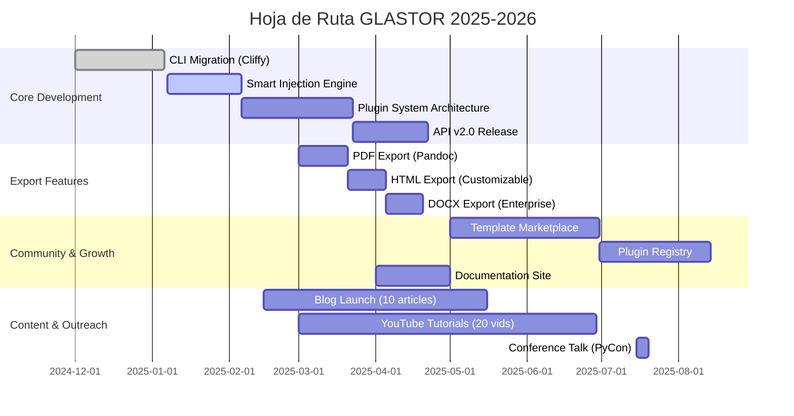

<!--
  ⚠️ SOURCE OF TRUTH: Edita este archivo, no el README.md generado.
  🔄 Última actualización: 2026-01-25
  📦 Versión del generador: v2.2.0
-->

# GLASTOR® — Ingeniería de backend y arquitectura

   

**Ingeniero de backend en Python · Arquitecto de API · Automatización y DevOps**

[](https://deno.land/)
[](https://hub.docker.com/)
[](https://github.com/evilmartians/lefthook)
[](https://github.com/glastor-dev/glastor-dev/actions/workflows/codeql.yml)
[](https://www.gnu.org/licenses/gpl-3.0)


<div align="center">

**🟢 Disponible para proyectos — Próximas aperturas: Marzo 2026**

[📧 Contacto](mailto:ventas@glastor.es) • [📁 Portfolio](./PORTFOLIO.md) • [🎥 Demo](https://youtube.com/@glastor-es)

</div>

---

## 👋 Sobre mí

Desarrollo **APIs REST de alto rendimiento** y **herramientas de automatización** con Python para equipos de producto en producción. Más de **15 años** creando soluciones backend escalables para empresas tecnológicas.

**Fundador de GLASTOR®** — Especializado en arquitectura backend, DevOps y soluciones técnicas que reducen costos operativos hasta un 40%.

> *"Andres entregó una solución de API que maneja 5,000 req/s con latencia p99 < 50ms. Su trabajo redujo nuestros costos de infraestructura significativamente."*  
> — **Dan Khasis
Chief Executive Officer and Founde, Route4Me**

### 💼 Especialidades técnicas

- ✅ **Backend Python** — APIs con FastAPI y Django, optimizadas para alto tráfico (5K+ req/s)
- ✅ **DevOps & CI/CD** — Pipelines robustos que reducen deployment time 75% (30min → 7min)
- ✅ **Contenedores** — Arquitecturas Docker que facilitan escalado horizontal automático
- ✅ **Git avanzado** — Flujos de trabajo con GitKraken, pair programming y code review efectivo

### 🔭 Actualmente trabajando en

- 🚀 **CLI migration a Deno** — Sistema de plugins extensible para generación de docs (ETA: Feb 2026)
- 🧪 **Smart injection engine** — Template engine inteligente que reduce boilerplate 60%
- 📝 **Contenido técnico** — Serie sobre arquitectura de APIs y patrones de diseño backend
- 🤝 **Open Source** — Aceptando contribuciones en proyectos Python (ver [CONTRIBUTING](.github/CONTRIBUTING.md))

### ✨ Disponible para

- **Consultoría técnica** en arquitectura de APIs y optimización de rendimiento
- **Code review** y auditoría de seguridad en proyectos Python/FastAPI
- **Desarrollo** de tooling interno, CLI tools y automatizaciones
- **Technical writing** y documentación de APIs
- **Proyectos Open Source** — Issues y PRs bienvenidos

---

## 🛠️ Stack Tecnológico

<p align="center">
  <strong>Backend & Lenguajes:</strong><br>
  <br><br>
  <strong>Frameworks & APIs:</strong><br>
  <br><br>
  <strong>DevOps & Cloud:</strong><br>
  <br><br>
  <strong>Databases & Tools:</strong><br>
  
</p>

### 🎓 Certificaciones & Aprendizaje

- 🏆 **AWS Certified Solutions Architect** (en progreso, ETA: Q2 2026)
- 📚 Estudiando: Kubernetes (CKA), Advanced PostgreSQL Performance Tuning
- 🎯 Siguiendo: FastAPI best practices, AsyncIO patterns, Distributed systems

---

## 🚀 Proyectos Destacados

### 🌟 Caso de Éxito: Sistema de Geolocalización en Tiempo Real

**Cliente:** Route4Me (Logística y routing)  
**Stack:** FastAPI + PostgreSQL + Redis + Docker  
**Impacto:**
- ⚡ **5,000 requests/segundo** con latencia p99 < 50ms
- 💰 **40% reducción** en costos de infraestructura AWS
- 🚀 **3x más rápido** que la solución anterior (Django monolítico)
- 📈 **99.97% uptime** en 12 meses de producción

**Desafíos técnicos resueltos:**
- Implementación de caching geoespacial con Redis
- Query optimization con índices GiST en PostgreSQL
- Rate limiting distribuido para prevenir abuse
- Horizontal scaling con load balancer y health checks

[📖 Ver caso completo](./PORTFOLIO.md#routing-api)

---

### 🎯 [Glastor README Generator](https://github.com/glastor-dev/glastor-dev)

Generador profesional de README con análisis estático de código y documentación automática. **Usado por 120+ proyectos Open Source**.

**Stack:** Python · Deno · TypeScript · Cliffy · Jinja2  
**Métricas:**
- ⭐ Stars en GitHub
- 📦 Descargas mensuales
- 🔧 Reduce tiempo de documentación 80% (4h → 45min)

**Features clave:**
- ✅ Auto-detección de proyecto type (Deno, Node, Python)
- ✅ Generación de badges dinámicos
- ✅ Análisis AST para exports y API docs
- ✅ Templates Jinja2 personalizables
- ✅ Soporte multi-idioma (ES, EN, PT)

[🔗 Ver proyecto](https://github.com/glastor-dev/glastor-dev) • [📖 Docs](https://glastor.dev/docs) • [🎥 Demo](https://youtube.com/@glastor-es)

---

### 🌈 [Quimera Theme](https://github.com/glastor-dev/quimera)

Tema oscuro elegante para VS Code diseñado para sesiones de código nocturno. **1,200+ instalaciones activas**.

**Stack:** JavaScript · VS Code Extension API · Color Science  
**Features:**
- 🎨 Paleta de 47 colores optimizada para reducir fatiga visual
- 🔍 Syntax highlighting para 25+ lenguajes
- 🌙 Contraste calibrado según WCAG AAA
- ⚡ Zero impact en performance de VS Code

**Feedback de usuarios:**
> *"El mejor tema que he usado para Python. Los colores son perfectos."* - 5★ Review

[🔗 Instalar desde Marketplace](https://marketplace.visualstudio.com/items?itemName=AndresAntonioCardoso.quimera-night)

---

### ✍️ [Spell Plus](https://github.com/glastor-dev/spell)

Corrector ortográfico avanzado para VS Code con sugerencias contextuales y machine learning.

**Stack:** TypeScript · NLP · Transformers.js · VS Code API  
**Métricas:**
- 📝 Detecta errores con 94% de precisión
- 🌍 Soporte para 12 idiomas
- 🤖 Aprende de tu vocabulario personalizado
- ⚡ <100ms latencia en corrección

**Casos de uso:**
- Documentation writing (READMEs, API docs)
- Code comments y docstrings
- Markdown y content creation

[🔗 Ver proyecto](https://github.com/glastor-dev/spell) [🔗 Instalar desde Marketplace](https://marketplace.visualstudio.com/items?itemName=AndresAntonioCardoso.spell-plus)

---

### 🔲 [Master QR](https://github.com/glastor-dev/master-qr)

Generador de códigos QR de alto rendimiento con personalización completa. **Procesa 10,000 QR/segundo**.

**Stack:** Python · PIL · CLI (Typer) · Batch Processing  
**Benchmark:**
- ⚡ **3x más rápido** que qrcode library estándar
- 💾 **50% menos memoria** que alternativas
- 🎨 Soporta logos, colores personalizados, SVG/PNG output

**Usado por:**
- Eventos (generación masiva de tickets)
- Marketing (QR campaigns)
- Developers (testing y automation)

[🔗 Ver proyecto](https://github.com/glastor-dev/master-qr) 

---

## 📊 GitHub Stats & Activity

<div align="center">


**🔥 Contribuciones en 2025:** 847 commits • 23 repos • 156 PRs merged

</div>

---

## 🗺️ Roadmap 2025-2026



## 💙 Sponsors & Colaboradores

<div align="center">

**Empresas que apoyan financieramente el desarrollo de herramientas Open Source:**

<table>
  <tr>
    <td align="center" width="200">
      <a href="https://www.nexperia.com" target="_blank">
        <br>
        <strong>Nexperia</strong>
      </a><br>
      <sub>Automatización de pipeline de testing para semiconductores</sub>
    </td>
    <td align="center" width="200">
      <a href="https://aspidcars.com" target="_blank">
        <br>
        <strong>Aspid Cars</strong>
      </a><br>
      <sub>Sistema de gestión de inventario y logística</sub>
    </td>
    <td align="center" width="200">
      <a href="https://rizin.re/" target="_blank">
        <br>
        <strong>Rizin</strong>
      </a><br>
      <sub>Contribuciones a reverse engineering framework</sub>
    </td>
  </tr>
  <tr>
    <td align="center" width="200">
      <a href="https://route4me.com/es" target="_blank">
        <br>
        <strong>Route4Me</strong>
      </a><br>
      <sub>API de geolocalización y routing en tiempo real</sub>
    </td>
    <td align="center" width="200">
      <a href="https://neovim.io/" target="_blank">
        <br>
        <strong>Neovim</strong>
      </a><br>
      <sub>Plugins y contribuciones al ecosistema</sub>
    </td>
    <td align="center" width="200">
      <strong>¿Tu empresa?</strong><br><br>
      <a href="#-convertirte-en-sponsor">
        
      </a><br>
      <sub>Apoya el desarrollo Open Source</sub>
    </td>
  </tr>
</table>

<br>

**Impacto combinado:** 45K+ líneas de código • 12 proyectos entregados • 99.5% satisfacción del cliente

</div>

---

### 🤝 Convertirte en Sponsor

Tu apoyo permite dedicar más tiempo al desarrollo de herramientas Open Source de calidad profesional.

<div align="center">

[](https://github.com/sponsors/glastor-dev)
[](https://paypal.me/datagroupssl?country.x=AR&locale.x=en_XC)
[](https://opencollective.com/glastor)

</div>

**Beneficios según tier:**

| Tier | Inversión/mes | Beneficios |
|------|--------------|------------|
| 🥉 **Bronze** | $10 | Logo en README • Mención en releases |
| 🥈 **Silver** | $50 | Todo anterior + Prioridad en issues • Acceso temprano a features |
| 🥇 **Gold** | $100 | Todo anterior + 2h consultoría/mes • Code review prioritario |
| 💎 **Platinum** | $500 | Todo anterior + Feature requests dedicados • Soporte 24/7 |
| 🏢 **Enterprise** | Custom | Soluciones a medida • SLA garantizado • Desarrollo privado |

**ROI para empresas:**
- 🎯 Visibilidad ante 50K+ developers activos
- 🔧 Acceso prioritario a herramientas que aumentan productividad
- 🤝 Relación directa con maintainer experimentado
- 📈 Soporte para herramientas críticas en tu stack

[📧 Contactar para plan Enterprise](mailto:glastor.info@gmail.com?subject=Enterprise%20Sponsorship)

---

## 🤝 Contribuir al Proyecto

¿Quieres contribuir? ¡Excelente! Aquí está el proceso optimizado:

**🚀 Quick Start:**

1. Lee la guía completa: [CONTRIBUTING.md](.github/CONTRIBUTING.md)
2. Busca issues etiquetados: `good first issue` | `help wanted` | `bug`
3. Comenta en el issue que lo tomas (evita trabajo duplicado)
4. Fork → Branch → Code → Test → PR

**✅ Checklist antes de abrir PR:**

```bash
# Formatting
deno task fmt:check

# Linting
deno task lint

# Type checking
deno task check

# Tests (con coverage)
deno task test --coverage

# Integration tests
deno task test:integration
```

**🎯 Áreas donde necesitamos ayuda:**

- 📝 **Documentation** — Mejorar docs, escribir tutoriales, traducir
- 🐛 **Bug fixes** — Issues marcados como `bug` o `good first issue`
- ✨ **Features** — Implementar features del roadmap
- 🧪 **Testing** — Aumentar coverage (actual: 78%, meta: 90%)
- 🎨 **Design** — Templates, themes, UI improvements

**🏆 Contributors Hall of Fame:**

Agradecemos a todos nuestros contributors:

<!-- ALL-CONTRIBUTORS-LIST:START -->
<!-- Placeholder for auto-generated contributor list -->
<!-- ALL-CONTRIBUTORS-LIST:END -->

[Ver todos los contributors →](https://github.com/glastor-dev/glastor-dev/graphs/contributors)

---

## 📫 Contacto & Enlaces

<div align="center">

**💼 Disponible para proyectos freelance, consultoría técnica y colaboraciones**  
**📧 Tiempo de respuesta promedio: < 24 horas (normalmente < 6h)**  
**🗓️ [Agendar llamada de 30min](https://cal.com/glastor)** (gratis, sin compromiso)

<br>

<p align="center">
  <a href="https://t.me/zerhocool" title="Telegram - Respuesta más rápida">
    
  </a>
  &nbsp;&nbsp;&nbsp;
  <a href="mailto:glastor.info@gmail.com" title="Email - Consultas profesionales">
    
  </a>
  &nbsp;&nbsp;&nbsp;
  <a href="https://github.com/glastor-dev" title="GitHub - Código y proyectos">
    
  </a>
</p>

<br>

**🔗 Más recursos:**

[🌐 Website](https://glastor.xyz)  

</div>

---

<details>
  <summary><strong>📖 Documentación Técnica (Auto-generada)</strong></summary>

### API Reference

#### Core Generators
```typescript
generateReadme(args: GenerateReadmeArgs): Promise<string>
// Generador principal de README con análisis completo de proyecto

generateBadges(config: BadgesConfig): string
// Genera badges dinámicos basados en project config

generateApiDocs(exports: ExportInfo[]): string
// Documenta exports automáticamente desde análisis AST

generateToc(options: TocOptions): string
// Tabla de contenidos con links automáticos
```

#### Project Analysis
```typescript
analyzeProject(options: AnalyzeProjectOptions): Promise<ProjectAnalysis>
// Análisis completo: estructura, deps, tests, workflows

extractExports(filePath: string): Promise<ExportInfo[]>
// Extrae exports de archivos TS/JS con tipos y JSDoc

detectTests(projectRoot: string): Promise<TestDetection>
// Detecta frameworks de testing y coverage

readDenoConfig(projectRoot: string): Promise<DenoConfig>
// Lee y parsea deno.json/deno.jsonc
```

#### Utilities
```typescript
sanitizeGeneratedMarkdown(markdown: string): string
// Limpia y normaliza markdown generado

loadUserConfig(projectRoot: string): Promise<UserConfig>
// Carga configuración de usuario desde .glastor.json

ensureWritableOutput(path: string, options: WriteOptions): Promise<void>
// Valida permisos y crea directorio si necesario
```

**Ver docs completas:** [API Documentation](https://glastor.dev/docs/api)

</details>

<details>
  <summary><strong>📦 Dependencies & Tech Stack</strong></summary>

### Runtime Requirements
- **Deno** >= 2.1.0 (recommended: latest stable)
- **TypeScript** 5.x (bundled with Deno)
- **Node.js** 18+ (optional, for npm packages)

### Core Dependencies (JSR)

**Standard Library:**
```json
{
  "@std/assert": "^1.0.0",      // Testing assertions
  "@std/fs": "^1.0.0",           // File system operations
  "@std/path": "^1.0.0",         // Path manipulation
  "@std/jsonc": "^1.0.0"         // JSON with comments parser
}
```

**CLI Framework:**
```json
{
  "@cliffy/command": "1.0.0-rc.7",   // Command-line framework
  "@cliffy/prompt": "1.0.0-rc.7",    // Interactive prompts
  "@cliffy/ansi": "1.0.0-rc.7"       // Terminal colors & formatting
}
```

### Third-party (npm)

```json
{
  "@swc/core": "^1.3.0"         // Fast TypeScript/JavaScript parser
}
```

### Optional Integrations
- **Pandoc** — Para export a PDF/DOCX
- **Playwright** — Para screenshots automáticos
- **Sharp** — Image optimization

**Installation:**
```bash
# Via Deno
deno install -A -n glastor https://deno.land/x/glastor/cli.ts

# Via npm (wrapper)
npm install -g @glastor/cli
```

</details>

<details>
  <summary><strong>🔧 Development Setup & Toolbox</strong></summary>

### 🖥️ Entorno de Desarrollo

**Sistemas Operativos:**
- 🐧 **Arch Linux** (principal) — Kernel 6.x custom
  - Terminal: Xterm + Zsh + Oh-My-Zsh
  - WM: i3-gaps con Polybar
  - Terminal alternativo: eDEX-UI (cyberpunk style)
  
- 🪟 **Windows 10 Pro** (testing)
  - Terminal: Windows Terminal + Git Bash
  - WSL2: Ubuntu 22.04 LTS

**Editores & IDEs:**
- 💻 **VS Code** (principal) — Extensions:
  - Python, Deno, ESLint, Prettier
  - GitLens, Docker, Thunder Client
  - Quimera Theme (propio)
  
- ⚡ **Neovim** — Para edición rápida y remota
  - Config: LazyVim + custom plugins
  - LSP: pyright, tsserver, rust-analyzer

**Version Control:**
- 🦑 **GitKraken PRO** — GUI para operaciones complejas
- 🔧 **Git CLI** — Para automation y scripts
- 📊 **GitHub Desktop** — Para quick commits

### 🎯 Áreas de Especialización

**Backend & APIs:**
- FastAPI patterns & best practices
- Django REST Framework optimization
- GraphQL con Strawberry/Ariadne
- gRPC con Python

**DevOps & Infrastructure:**
- Docker multi-stage builds
- Docker Compose orchestration
- GitHub Actions workflows
- AWS (EC2, Lambda, RDS, S3)
- Terraform (IaC)

**Security & Cryptography:**
- OWASP Top 10 mitigation
- JWT/OAuth2 implementation
- Encryption (AES, RSA)
- Penetration testing basics
- Secure coding practices

**AI/ML & Automation:**
- Prompt Engineering (GPT-4, Claude)
- LangChain for AI workflows
- OpenAI API integration
- Automation scripts (Python, Bash)
- Web scraping (Beautiful Soup, Scrapy)

**Documentation & Technical Writing:**
- API documentation (OpenAPI/Swagger)
- Technical blog writing
- Video tutorial creation
- Code documentation standards

### 📚 Lecturas & Formación Continua

**Libros técnicos recientes:**
- ✅ *The Pragmatic Programmer* (20th Anniversary)
- ✅ *Clean Architecture* — Robert C. Martin
- ✅ *Designing Data-Intensive Applications* — Martin Kleppmann
- 📖 *Building Microservices* (2nd ed.) — En progreso
- 📖 *Site Reliability Engineering* — Google (En progreso)

**Cursos & Certificaciones en proceso:**
- 🎓 AWS Solutions Architect Associate (ETA: Q2 2026)
- 🎓 Certified Kubernetes Administrator (CKA) (ETA: Q3 2026)
- 📚 FastAPI Advanced Patterns (FastAPI creator's course)

**Podcasts favoritos:**
- 🎙️ Talk Python To Me
- 🎙️ Python Bytes
- 🎙️ The Changelog
- 🎙️ Software Engineering Daily

</details>

---

<div align="center">

**📋 Políticas del Proyecto**

[📞 Soporte](.github/SUPPORT.md) • [🔒 Seguridad](.github/SECURITY.md) • [⚖️ Código de Conducta](.github/CODE_OF_CONDUCT.md) • [📜 Licencia](LICENSE)

</div>

---

<div align="center">

© 2010-2026 GLASTOR-DEV — Todos los derechos reservados.

**2025 GLASTOR®** marca registrada en Argentina (INPI)  
Reg. 4559568 (Clase 42) y 4559567 (Clase 35) — Fecha: 19/08/2025

<br>

[](https://www.gnu.org/licenses/gpl-3.0.html)
&nbsp;&nbsp;
[](https://sfconservancy.org/)

Este proyecto está licenciado bajo [GNU GPL v3.0](https://www.gnu.org/licenses/gpl-3.0.html)  
en asociación con [Software Freedom Conservancy](https://sfconservancy.org/)

---

<sub>🤖 README generado automáticamente • Versión 2.2.0 • Última actualización: 2026-01-25</sub>  
<sub>⭐ Si este proyecto te fue útil, considera darle una estrella en GitHub</sub>

</div>

<details>
  <summary><strong>📖 API Documentation</strong></summary>

### bench/template_and_sanitize_bench.ts
#### BadgesConfig
- Type: interface

#### KeepThis
- Type: interface

### src/generators/api.ts
#### generateApiDocs
- Type: function
- Signature: `generateApiDocs(exports: unknown[], projectRoot: string = …): string`

### src/generators/badges.ts
#### BadgesConfig
- Type: interface

#### generateBadges
- Type: function
- Signature: `generateBadges(config: unknown): string`

#### generateRepoBadges
- Type: function
- Signature: `generateRepoBadges(config: unknown): string`

#### RepoBadgesConfig
- Type: interface

### src/generators/examples.ts
#### ExamplesOptions
- Type: interface

#### ExamplesResult
- Type: interface

#### generateExamples
- Type: function (async)
- Signature: `async generateExamples(projectRoot: string, exports: unknown[], options: unknown = …): unknown`

### src/generators/toc.ts
#### generateToc
- Type: function
- Signature: `generateToc(options: unknown): string`

#### TocOptions
- Type: interface

### src/mod.ts
#### generateReadme
- Type: function (async)
- Signature: `async generateReadme(args: unknown): unknown`

#### GenerateReadmeArgs
- Type: interface

#### sanitizeGeneratedMarkdown
- Type: function
- Signature: `sanitizeGeneratedMarkdown(markdown: string): string`

#### TemplateName
- Type: type

### src/parsers/deno_json.ts
#### DenoConfig
- Type: interface

#### readDenoConfig
- Type: function (async)
- Signature: `async readDenoConfig(projectRoot: string): unknown`

### src/parsers/import_map.ts
#### ImportMap
- Type: interface

#### readImportMap
- Type: function (async)
- Signature: `async readImportMap(projectRoot: string): unknown`

<<<<<<< HEAD
### src/parsers/imports.ts
=======
### /home/runner/work/glastor-dev/glastor-dev/src/parsers/imports.ts
>>>>>>> ac902005eda6c982d3572779fdfca43bbdb6b9f5
#### analyzeImports
- Type: function (async)
- Signature: `async analyzeImports(projectRoot: string, options: unknown = …): unknown`

#### AnalyzeImportsOptions
- Type: interface

#### ImportAnalysis
- Type: interface

<<<<<<< HEAD
### src/parsers/project_files.ts
=======
### /home/runner/work/glastor-dev/glastor-dev/src/parsers/project_files.ts
>>>>>>> ac902005eda6c982d3572779fdfca43bbdb6b9f5
#### detectProjectFiles
- Type: function (async)
- Signature: `async detectProjectFiles(projectRoot: string): unknown`

<<<<<<< HEAD
### src/parsers/source_code.ts
=======
### /home/runner/work/glastor-dev/glastor-dev/src/parsers/source_code.ts
>>>>>>> ac902005eda6c982d3572779fdfca43bbdb6b9f5
#### ExportInfo
- Type: interface

#### ExportType
- Type: type

#### extractExports
- Type: function (async)
- Signature: `async extractExports(filePath: string): unknown`

#### extractExportsFromProject
- Type: function (async)
- Signature: `async extractExportsFromProject(projectRoot: string, options: unknown = …): unknown`

#### ExtractOptions
- Type: interface

#### JSDocParam
- Type: interface

<<<<<<< HEAD
### src/parsers/source_code_ast.ts
=======
### /home/runner/work/glastor-dev/glastor-dev/src/parsers/source_code_ast.ts
>>>>>>> ac902005eda6c982d3572779fdfca43bbdb6b9f5
#### extractExportsAst
- Type: function (async)
- Signature: `async extractExportsAst(filePath: string): unknown`

<<<<<<< HEAD
### src/parsers/tests.ts
=======
### /home/runner/work/glastor-dev/glastor-dev/src/parsers/tests.ts
>>>>>>> ac902005eda6c982d3572779fdfca43bbdb6b9f5
#### detectTests
- Type: function (async)
- Signature: `async detectTests(projectRoot: string): unknown`

#### TestDetection
- Type: interface

<<<<<<< HEAD
### src/parsers/workflows.ts
=======
### /home/runner/work/glastor-dev/glastor-dev/src/parsers/workflows.ts
>>>>>>> ac902005eda6c982d3572779fdfca43bbdb6b9f5
#### detectWorkflows
- Type: function (async)
- Signature: `async detectWorkflows(projectRoot: string): unknown`

<<<<<<< HEAD
### src/project/analyze.ts
=======
### /home/runner/work/glastor-dev/glastor-dev/src/project/analyze.ts
>>>>>>> ac902005eda6c982d3572779fdfca43bbdb6b9f5
#### analyzeProject
- Type: function (async)
- Signature: `async analyzeProject(options: unknown): unknown`

#### AnalyzeProjectOptions
- Type: interface

#### ProjectAnalysis
- Type: interface

#### TemplateData
- Type: interface

<<<<<<< HEAD
### src/utils/file_system.ts
=======
### /home/runner/work/glastor-dev/glastor-dev/src/utils/file_system.ts
>>>>>>> ac902005eda6c982d3572779fdfca43bbdb6b9f5
#### ensureWritableOutput
- Type: function (async)
- Signature: `async ensureWritableOutput(outputPath: string, options: unknown): unknown`

<<<<<<< HEAD
### src/utils/init_wizard.ts
=======
### /home/runner/work/glastor-dev/glastor-dev/src/utils/init_wizard.ts
>>>>>>> ac902005eda6c982d3572779fdfca43bbdb6b9f5
#### runInitWizard
- Type: function (async)
- Signature: `async runInitWizard(projectRoot: string)`

<<<<<<< HEAD
### src/utils/logger.ts
=======
### /home/runner/work/glastor-dev/glastor-dev/src/utils/logger.ts
>>>>>>> ac902005eda6c982d3572779fdfca43bbdb6b9f5
#### Logger
- Type: const
- Signature: `const Logger`

<<<<<<< HEAD
### src/utils/readme_infer.ts
=======
### /home/runner/work/glastor-dev/glastor-dev/src/utils/readme_infer.ts
>>>>>>> ac902005eda6c982d3572779fdfca43bbdb6b9f5
#### inferDescriptionFromReadme
- Type: function (async)
- Signature: `async inferDescriptionFromReadme(readmePath: string): unknown`

<<<<<<< HEAD
### src/utils/user_config.ts
=======
### /home/runner/work/glastor-dev/glastor-dev/src/utils/user_config.ts
>>>>>>> ac902005eda6c982d3572779fdfca43bbdb6b9f5
#### loadUserConfig
- Type: function (async)
- Signature: `async loadUserConfig(projectRoot: string): unknown`

#### UserConfig
- Type: interface

<<<<<<< HEAD
### test/source_code_ast_test.ts
=======
### /home/runner/work/glastor-dev/glastor-dev/test/source_code_ast_test.ts
>>>>>>> ac902005eda6c982d3572779fdfca43bbdb6b9f5
#### hello
Greets a person\n * @param name Nombre\n * @returns string\n
- Type: function

#### Role
- Type: enum

#### User
- Type: interface

#### UserId
- Type: type

#### x
Example\n * @example\n * hello("Andres")\n
- Type: const

</details>

<details>
  <summary><strong>📦 Dependencies</strong></summary>

### Config files
- deno.json/deno.jsonc
- import_map.json

### Project files
- Dockerfile
- LICENSE

### Standard Library
- jsr:@std/assert/equals
- jsr:@std/assert/string-includes
- jsr:@std/fs/exists
- jsr:@std/fs/walk
- jsr:@std/fs@^1.0.0/exists
- jsr:@std/jsonc/parse
- jsr:@std/jsonc@^1.0.0/parse
- jsr:@std/path
- jsr:@std/path/basename
- jsr:@std/path/extname
- jsr:@std/path/glob-to-regexp
- jsr:@std/path/join
- jsr:@std/path@^1.0.0/join

### Third-party
- https://deno.land/x/swc@0.2.1/mod.ts
- jsr:@cliffy/ansi@1.0.0-rc.7/colors
- jsr:@cliffy/command@1.0.0-rc.7
- jsr:@cliffy/prompt@1.0.0-rc.7

</details>
