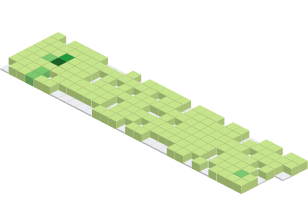
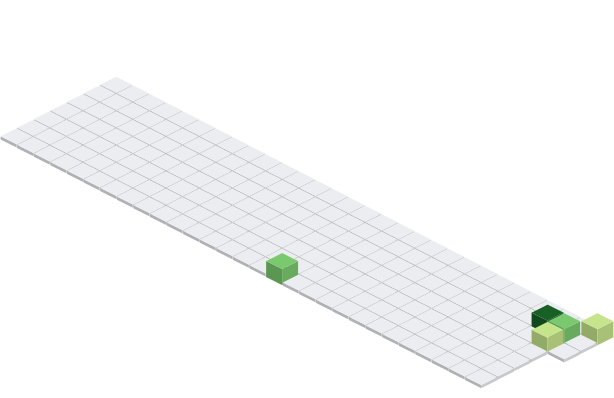

# Andrés Antonio Cardoso - Full Stack Developer 👋

## Especialista en Python | Diseñador | Creador de Contenido

 

<!-- Badges de estado y cobertura -->

Construyo APIs, tooling y automatizaciones con Python para productos y equipos (FastAPI/Django, CI/CD y Docker).

Para presupuestos o colaboraciones: [Email](mailto:glastor.info@gmail.com) o [Telegram](https://t.me/zerhocool).

Open Source: Issues y PRs bienvenidos — ver [CONTRIBUTING.md](.github/CONTRIBUTING.md).

Políticas: [Soporte](.github/SUPPORT.md) • [Seguridad](.github/SECURITY.md) • [Código de Conducta](.github/CODE_OF_CONDUCT.md)

## 👨‍💻 Sobre Mí

🚀 Desarrollador Python con + de 10 años de experiencia en tecnologías web y diseño creativo. Me enfoco en construir soluciones eficientes y escalables, y en compartir conocimiento a través de contenido técnico.

Fundé GLASTOR en 2014 y en 2025 registré la marca en el INPI. Actualmente estoy migrando a GitHub repositorios privados que mantengo en otras plataformas. Vivo en Girona (España) desde 2022.

> *Construyendo el futuro, una línea de código a la vez*

  
<strong>EXTRAS: Toolbox</strong>

🖥️ **Sistema Operativo:**

- Arch Linux, terminal Xterm o eDEX-UI
- Windows 10 Pro, terminal Bash personalizada

🍸 **Intereses:**

- DevOps - Protocolos de Comunicación
- Seguridad informática - Criptografía
- Documentación de Software - Prompt Engineering - IA

🕐 **Idiomas:**

- Aprendiendo Catalán y estonio
- Mejorando mi inglés

📗 **Último libro:**

- El libro negro del programador
- El arte de la invisibilidad
- Blue Team Handbook
- Hacking Ético 101
- Biohacker
- El libro blanco del hacker
- Big Data, Machine Learning y Data Science en Python

- 🔭 Generador avanzado de README con integración de IA
- 🌱 Aprendiendo Machine Learning y Data Science
- 👯 Abierto a colaborar en proyectos Open Source en Python
- 💬 Pregúntame sobre Python, Django, FastAPI y desarrollo web
- ⚡ Automatizo todo lo que hago más de dos veces

---

## 📊 Estadísticas de GitHub

 

  <i>GA4 G-7X*08T**** - Visitas de perfil:</i>⠀

### “OSS Insight es un servicio de analíticas que te permite medir el tráfico y la interacción en tus sitios web y aplicaciones dirigidos a desarrolladores”

### 🖥️ CONTRIBUCIONES

<!-- Centered images for contributions -->

---

## 🛠️ Stack Tecnológico

### 💻 Lenguajes y Frameworks

  

### INSIGNIAS: 

  
  &#8287;&#8287;&#8287;&#8287;&#8287;
  
  &#8287;&#8287;&#8287;&#8287;&#8287;
  
  &#8287;&#8287;&#8287;&#8287;&#8287;
  
  &#8287;&#8287;&#8287;&#8287;&#8287;

---

## 🚀 Proyectos Destacados

### 🎯 Glastor README Generator

Generador profesional de README con plantillas Jinja2, copyright automático y soporte multi-idioma

Ideal para estandarizar documentación y acelerar el onboarding de repositorios.

**Stack Tecnológico:** Python • Jinja2 • Typer • Rich

**Repositorio:** [Ver Código](https://github.com/glastor-dev/glastor-dev)
**Destacados:** Copyright automático • Multi-idioma • Herramienta CLI • 100% cobertura de tests

### 🚀 FastAPI Microservices

Arquitectura escalable de microservicios con FastAPI, Docker y PostgreSQL

Pensado para backends con rendimiento, despliegue reproducible y crecimiento modular.

**Stack Tecnológico:** FastAPI • Docker • PostgreSQL • Redis

**Destacados:** Async/await • Auth JWT • Docker Compose • Documentación de API

### 🎨 Design Portfolio

Portafolio personal mostrando proyectos de diseño y desarrollo

Enfocado en UI moderna y una presencia online clara para productos y perfiles.

**Stack Tecnológico:** React • TypeScript • Tailwind CSS

**Demo en Vivo:** [Visitar Sitio](https://glastor.dev)
**Destacados:** Diseño responsive • Modo oscuro • Animaciones • SEO optimizado

---

## 📝 Artículos &amp; Tutoriales

- **🐍 Mejores prácticas en Python 2025** - [YouTube](https://www.youtube.com/watch?v=PtBHnMMRI0E) *(2025)*
- **🚀 Construyendo APIs escalables con FastAPI** - [YouTube](https://www.youtube.com/watch?v=WXghq9Y4Fms) *(2025)*

---

- Ser Sponsor, mas informacion en [`CONTRIBUTORS.md`](.github/CONTRIBUTING.md)

  
  &#8287;&#8287;&#8287;&#8287;&#8287;
  
  &#8287;&#8287;&#8287;&#8287;&#8287;

- Gracias a estas empresas por su apoyo y confianza en este equipo.

---

## 📫 Contacto

💼 Disponible para proyectos freelance y colaboraciones
📧 Respondo generalmente en 24 horas

  
  
  
  

---

🔹 Si tu gustó este README scanea el codigo QR, deja tu Like 👍, dándole una estrella (starring) y compartiendo el proyecto 🚀.

  
  &#8287;&#8287;&#8287;&#8287;&#8287;
  

---

© 2010-2025 Andrés Antonio Cardoso — Todos los derechos reservados. GLASTOR® marca registrada en Argentina (INPI) — Reg. 4559568 (Clase 42) y 4559567 (Clase 35), 19/08/2025.

              

Esta obra está bajo [Licencia GNU General Publica (GNU GPL v3.0) -](https://www.gnu.org/licenses/gpl-3.0.html) [Software Freedom Conservancy.](https://sfconservancy.org/)

Este README se actualiza automáticamente

