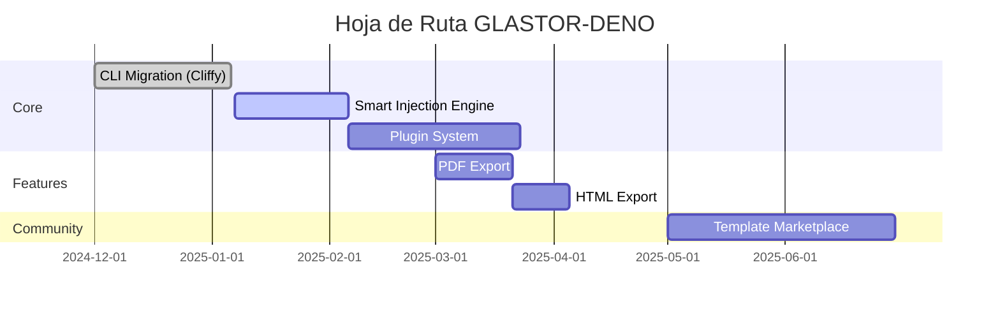

<!--
  ⚠️ SOURCE OF TRUTH: Edita este archivo, no el README.md generado.
-->
# GLASTOR® — Ingeniería de backend y arquitectura

## Ingeniero de backend en Python · Arquitecto de API · Automatización y DevOps

   

## 🤝 Contribuir

¿Quieres contribuir? Empieza por aquí:

1. Lee la guía: [CONTRIBUTING.md](.github/CONTRIBUTING.md)
2. Elige un issue y comenta que lo tomas (ideal: `good first issue` / `help wanted`)
3. Abre un PR pequeño y enfocado

**Criterios para PRs:** `deno task fmt:check`, `deno task lint`, `deno task check`, `deno task test` en verde.

## 💙 Sponsor

Los patrocinios se pueden realizar a través de GitHub Sponsors o OpenCollective . Se aceptan tanto patrocinios mensuales recurrentes como donaciones puntuales. Los patrocinios recurrentes tienen derecho a la colocación de logotipos, según se especifica en los Niveles de Patrocinio.

---

## 🚀 Bio & Stack
Desarrollo de API, herramientas y automatizaciones con Python para productos y equipos (FastAPI/Django, CI/CD y Docker).

### 💼 Especialidad técnica

- ✅ Backend con FastAPI y Django – APIs rápidas, escalables y documentadas.
- ✅ DevOps y CI/CD – Pipelines eficientes, integración continua y despliegues confiables.
- ✅ Contenedores con Docker – Entornos reproducibles y listos para producción.
- ✅ Colaboración en Git – Experto en GitKraken para flujos de trabajo visuales, gestión de ramas y resolución de conflictos sin estrés.

### ✅ Disponible para

- 🐍 Proyectos Open Source en Python
- 🚀 Consultoría en APIs y arquitectura backend
- 📝 Creación de contenido técnico y tutoriales
- 🔧 Desarrollo de tooling y automatizaciones
- 🎨 Diseño de interfaces y experiencias de usuario

  
<strong>EXTRAS: Toolbox</strong>

🍸 **Intereses:**

- DevOps - Protocolos de Comunicación
- Seguridad informática - Criptografía
- Documentación de Software - Prompt Engineering - IA

📗 **Último libro:**

- El libro negro del programador
- El arte de la invisibilidad
- Blue Team Handbook
- Hacking Ético 101
- Biohacker

## Estadísticas de GitHub generadas dinámicamente

## 🛠️ Stack Tecnológico

### 💻 Lenguajes y Frameworks

  <strong>Lenguajes &amp; Markup:</strong> 
    
  <strong>Frameworks &amp; Runtimes:</strong> 
    
  <strong>BBDD, Cloud &amp; DevOps:</strong> 
    
  <strong>Herramientas &amp; Diseño:</strong> 
  

---

## 🗺️ Roadmap 2025

---

## 📌 Repositorios Destacados

<table border="0">
  <tr>
    <td></td>
    <td></td>
  </tr>
  <tr>
    <td></td>
    <td></td>
  </tr>
</table>

---

## 🏆 Agradecimientos Especiales

**Empresas que han confiado en mi trabajo:** 
 &nbsp;&nbsp;
 &nbsp;&nbsp;
 &nbsp;&nbsp;
 &nbsp;&nbsp;
 
Proyectos desarrollados para estas organizaciones en infraestructura y automatización

---

## 📫 Contacto

💼 Disponible para proyectos freelance y colaboraciones
📧 Respondo generalmente en 24 horas

  
  &nbsp;&nbsp;
  
  &nbsp;&nbsp;
  
  &nbsp;&nbsp;
  

### 📱 Escanea para conectar rápido

Políticas: <a href=".github/SUPPORT.md">Soporte</a> • <a href=".github/SECURITY.md">Seguridad</a> • <a href=".github/CODE_OF_CONDUCT.md">Código de Conducta</a>

---

© 2010-2026 Andrés Antonio Cardoso — Todos los derechos reservados. 2026 GLASTOR® marca registrada en Argentina (INPI) — Reg. 4559568 (Clase 42) y 4559567 (Clase 35), 19/08/2025.

              

Esta obra está bajo [Licencia GNU General Publica (GNU GPL v3.0) -](https://www.gnu.org/licenses/gpl-3.0.html) [Software Freedom Conservancy.](https://sfconservancy.org/)

Los datos y métricas mostrados aquí se sincronizan periódicamente con los sistemas del proyecto.
