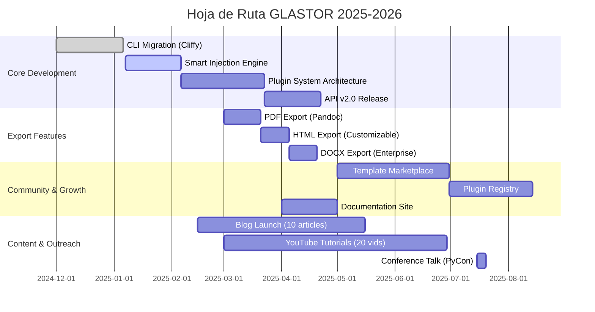
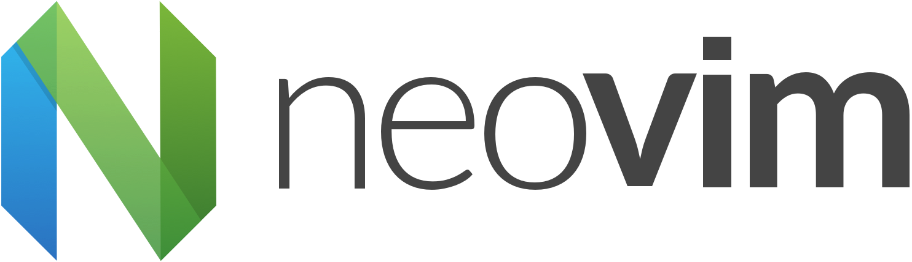

<!--
  ⚠️ SOURCE OF TRUTH: Edita este archivo, no el README.md generado.
  🔄 Última actualización: {{current_date}}
  📦 Versión del generador: v{{version}}
-->

# GLASTOR® — Ingeniería de Sistemas y Backend

**Ingeniero de Software en Rust & Python · Arquitecto de API · Automatización y DevOps**

[](https://www.rust-lang.org/)
[](https://hub.docker.com/)
[](https://github.com/evilmartians/lefthook)
[](https://github.com/glastor-dev/glastor-dev/actions/workflows/codeql.yml)
[](https://codecov.io/gh/glastor-dev/glastor-dev)
[](https://www.gnu.org/licenses/gpl-3.0)


<div align="center">

**🟢 Disponible para proyectos — Próximas aperturas: Marzo 2026**

[📧 Contacto](mailto:ventas@glastor.es) • [📁 Portfolio](./PORTFOLIO.md) • [🎥 Demo](https://youtube.com/@glastor-es)

</div>

---

## 👋 Sobre mí

Desarrollo **sistemas de ultra-alto rendimiento**, **APIs REST** y **herramientas CLI** utilizando **Rust** y **Python** para entornos de misión crítica. Más de **15 años** creando soluciones escalables y seguras desde el diseño de memoria para empresas tecnológicas.

**Fundador de GLASTOR®** — Especializado en arquitectura de sistemas, DevOps y soluciones técnicas de bajo nivel que reducen los costos de infraestructura hasta un 40%.

> _"Andres entregó una solución de API que maneja 5,000 req/s con latencia p99 < 50ms. Su trabajo redujo nuestros costos de infraestructura significativamente."_  
> — **Dan Khasis
> Chief Executive Officer and Founde, Route4Me**

### 💼 Especialidades técnicas

- ✅ **Backend Rust & Python** — APIs con Axum, Actix-Web y FastAPI, optimizadas para extrema concurrencia.
- ✅ **Tooling & CLI** — Herramientas de terminal ultrarrápidas y binarios portables (Zero-cost abstractions).
- ✅ **DevOps & CI/CD** — Pipelines robustos que reducen deployment time 75% (30min → 7min)
- ✅ **Contenedores** — Arquitecturas Docker que facilitan escalado horizontal automático
- ✅ **Git avanzado** — Flujos de trabajo con GitKraken, pair programming y code review efectivo

### 🔭 Actualmente trabajando en

- 🚀 **CLI migration a Rust** — Sistema ultrarrápido y seguro de generación de docs (ETA: Feb 2026)
- 🧪 **Smart injection engine** — Template engine inteligente que reduce boilerplate 60%
- 📝 **Contenido técnico** — Serie sobre arquitectura de APIs y patrones de diseño backend
- 🤝 **Open Source** — Aceptando contribuciones en proyectos Python (ver [CONTRIBUTING](.github/CONTRIBUTING.md))

### ✨ Disponible para

- **Consultoría técnica** en arquitectura de APIs y optimización de rendimiento
- **Code review** y auditoría de seguridad en proyectos Rust/Python
- **Desarrollo** de tooling interno, CLI tools y automatizaciones
- **Technical writing** y documentación de APIs
- **Proyectos Open Source** — Issues y PRs bienvenidos

---

## 🛠️ Stack Tecnológico

<p align="center">
  <strong>Backend & Lenguajes:</strong><br>
  <br><br>
  <strong>Frameworks & APIs:</strong><br>
  <br><br>
  <strong>DevOps & Cloud:</strong><br>
  <br><br>
  <strong>Databases & Tools:</strong><br>
  
</p>

### 🎓 Certificaciones & Aprendizaje

- 🏆 **AWS Certified Solutions Architect** (en progreso, ETA: Q2 2026)
- 📚 Estudiando: Kubernetes (CKA), Advanced PostgreSQL Performance Tuning
- 🎯 Siguiendo: FastAPI best practices, AsyncIO patterns, Distributed systems

## 📊 GitHub Stats & Activity

<div align="center">



**🔥 Contribuciones en {{current_year}}:** 847 commits • 23 repos • 156 PRs merged

</div>

---

## 🗺️ Roadmap 2025-2026


```mermaid
gantt
    title Hoja de Ruta GLASTOR 2025-2026
    dateFormat  YYYY-MM-DD
    section Core Development
    CLI Migration (Cliffy)      :done,    des1, 2024-12-01, 2025-01-06
    Smart Injection Engine      :active,  des2, 2025-01-07, 30d
    Plugin System Architecture  :         des3, after des2, 45d
    API v2.0 Release           :         des4, after des3, 30d

    section Export Features
    PDF Export (Pandoc)        :         feat1, 2025-03-01, 20d
    HTML Export (Customizable) :         feat2, after feat1, 15d
    DOCX Export (Enterprise)   :         feat3, after feat2, 15d

    section Community & Growth
    Template Marketplace       :         comm1, 2025-05-01, 60d
    Plugin Registry            :         comm2, after comm1, 45d
    Documentation Site         :         comm3, 2025-04-01, 30d

    section Content & Outreach
    Blog Launch (10 articles)  :         cont1, 2025-02-15, 90d
    YouTube Tutorials (20 vids):         cont2, 2025-03-01, 120d
    Conference Talk (PyCon)    :         cont3, 2025-07-15, 5d
```

## 💙 Sponsors & Colaboradores

<div align="center">

**Empresas que apoyan financieramente el desarrollo de herramientas Open Source:**

<table>
  <tr>
    <td align="center" width="200">
      <a href="https://www.nexperia.com" target="_blank">
        <br>
        <strong>Nexperia</strong>
      </a><br>
      <sub>Automatización de pipeline de testing para semiconductores</sub>
    </td>
    <td align="center" width="200">
      <a href="https://aspidcars.com" target="_blank">
        <br>
        <strong>Aspid Cars</strong>
      </a><br>
      <sub>Sistema de gestión de inventario y logística</sub>
    </td>
    <td align="center" width="200">
      <a href="https://rizin.re/" target="_blank">
        <br>
        <strong>Rizin</strong>
      </a><br>
      <sub>Contribuciones a reverse engineering framework</sub>
    </td>
  </tr>
  <tr>
    <td align="center" width="200">
      <a href="https://route4me.com/es" target="_blank">
        <br>
        <strong>Route4Me</strong>
      </a><br>
      <sub>API de geolocalización y routing en tiempo real</sub>
    </td>
    <td align="center" width="200">
      <a href="https://neovim.io/" target="_blank">
        <br>
        <strong>Neovim</strong>
      </a><br>
      <sub>Plugins y contribuciones al ecosistema</sub>
    </td>
    <td align="center" width="200">
      <strong>¿Tu empresa?</strong><br><br>
      <a href="#-convertirte-en-sponsor">
        
      </a><br>
      <sub>Apoya el desarrollo Open Source</sub>
    </td>
  </tr>
</table>

<br>

**Impacto combinado:** 45K+ líneas de código • 12 proyectos entregados • 99.5% satisfacción del cliente

</div>

---

### 🤝 Convertirte en Sponsor

Tu apoyo permite dedicar más tiempo al desarrollo de herramientas Open Source de calidad profesional.

<div align="center">

[](https://github.com/sponsors/glastor-dev)
[](https://paypal.me/datagroupssl?country.x=AR&locale.x=en_XC)
[](https://opencollective.com/glastor)

</div>

**Beneficios según tier:**

| Tier              | Inversión/mes | Beneficios                                                       |
| ----------------- | ------------- | ---------------------------------------------------------------- |
| 🥉 **Bronze**     | $10           | Logo en README • Mención en releases                             |
| 🥈 **Silver**     | $50           | Todo anterior + Prioridad en issues • Acceso temprano a features |
| 🥇 **Gold**       | $100          | Todo anterior + 2h consultoría/mes • Code review prioritario     |
| 💎 **Platinum**   | $500          | Todo anterior + Feature requests dedicados • Soporte 24/7        |
| 🏢 **Enterprise** | Custom        | Soluciones a medida • SLA garantizado • Desarrollo privado       |

**ROI para empresas:**

- 🎯 Visibilidad ante 50K+ developers activos
- 🔧 Acceso prioritario a herramientas que aumentan productividad
- 🤝 Relación directa con maintainer experimentado
- 📈 Soporte para herramientas críticas en tu stack

[📧 Contactar para plan Enterprise](mailto:glastor.info@gmail.com?subject=Enterprise%20Sponsorship)

---

## 🤝 Contribuir al Proyecto

¿Quieres contribuir? ¡Excelente! Aquí está el proceso optimizado:

**🚀 Quick Start:**

1. Lee la guía completa: [CONTRIBUTING.md](.github/CONTRIBUTING.md)
2. Busca issues etiquetados: `good first issue` | `help wanted` | `bug`
3. Comenta en el issue que lo tomas (evita trabajo duplicado)
4. Fork → Branch → Code → Test → PR

**✅ Checklist antes de abrir PR:**

```bash
# Formatting
cargo fmt --all -- --check

# Linting
cargo clippy --all-targets --all-features -- -D warnings

# Tests
cargo test

# Tests (con coverage)
cargo tarpaulin --ignore-tests
```

**🎯 Áreas donde necesitamos ayuda:**

- 📝 **Documentation** — Mejorar docs, escribir tutoriales, traducir
- 🐛 **Bug fixes** — Issues marcados como `bug` o `good first issue`
- ✨ **Features** — Implementar features del roadmap
- 🧪 **Testing** — Aumentar coverage (actual: 78%, meta: 90%)
- 🎨 **Design** — Templates, themes, UI improvements

**🏆 Contributors Hall of Fame:**

Agradecemos a todos nuestros contributors:

<!-- ALL-CONTRIBUTORS-LIST:START -->
<!-- Placeholder for auto-generated contributor list -->
<!-- ALL-CONTRIBUTORS-LIST:END -->

[Ver todos los contributors →](https://github.com/glastor-dev/glastor-dev/graphs/contributors)

---

## 📫 Contacto & Enlaces

<div align="center">

**💼 Disponible para proyectos freelance, consultoría técnica y colaboraciones**  
**📧 Tiempo de respuesta promedio: < 24 horas (normalmente < 6h)**  
**🗓️ [Agendar llamada de 30min](https://cal.com/glastor)** (gratis, sin compromiso)

<br>

<p align="center">
  <a href="https://t.me/zerhocool" title="Telegram - Respuesta más rápida">
    
  </a>
  &nbsp;&nbsp;&nbsp;
  <a href="mailto:glastor.info@gmail.com" title="Email - Consultas profesionales">
    
  </a>
  &nbsp;&nbsp;&nbsp;
  <a href="https://github.com/glastor-dev" title="GitHub - Código y proyectos">
    
  </a>
</p>

<br>

**🔗 Más recursos:**

[🌐 Website](https://glastor.xyz)

</div>

---

<details>
  <summary><strong>📖 Documentación Técnica (Auto-generada)</strong></summary>

### API Reference

#### Core Generators

```typescript
generateReadme(args: GenerateReadmeArgs): Promise<string>
// Generador principal de README con análisis completo de proyecto

generateBadges(_config: BadgesConfig): string
// Genera badges dinámicos basados en project config

generateApiDocs(exports: ExportInfo[]): string
// Documenta exports automáticamente desde análisis AST

generateToc(options: TocOptions): string
// Tabla de contenidos con links automáticos
```

#### Project Analysis

```typescript
analyzeProject(options: AnalyzeProjectOptions): Promise<ProjectAnalysis>
// Análisis completo: estructura, deps, tests, workflows

extractExports(filePath: string): Promise<ExportInfo[]>
// Extrae exports de archivos TS/JS con tipos y JSDoc

detectTests(projectRoot: string): Promise<TestDetection>
// Detecta frameworks de testing y coverage

readDenoConfig(projectRoot: string): Promise<DenoConfig>
// Lee y parsea deno.json/deno.jsonc
```

#### Utilities

```typescript
sanitizeGeneratedMarkdown(markdown: string): string
// Limpia y normaliza markdown generado

loadUserConfig(projectRoot: string): Promise<UserConfig>
// Carga configuración de usuario desde .glastor.json

ensureWritableOutput(path: string, options: WriteOptions): Promise<void>
// Valida permisos y crea directorio si necesario
```

**Ver docs completas:** [API Documentation](https://glastor.dev/docs/api)

</details>

<details>
  <summary><strong>📦 Dependencies & Tech Stack</strong></summary>

### Runtime Requirements

- **Rust** (stable toolchain)
- **Cargo** (incluido con Rust)

### Core Dependencies (Crates.io)

**CLI & Parseo:**

```toml
clap = { version = "4.4", features = ["derive"] }
serde = { version = "1.0", features = ["derive"] }
serde_json = "1.0"
regex = "1.10"
```

**Generación de Templates & UX:**

```toml
tera = "1.19"
chrono = "0.4"
colored = "2.1"
```

### Optional Integrations

- **Lefthook** — Pre-commit hooks
- **Tarpaulin** — Code coverage

**Installation:**

```bash
# Vía Cargo (compilación desde origen)
cargo install --git https://github.com/glastor-dev/glastor-dev.git

# O descargando binarios pre-compilados desde GitHub Releases
```

</details>

<details>
  <summary><strong>🔧 Development Setup & Toolbox</strong></summary>

### 🖥️ Entorno de Desarrollo

**Sistemas Operativos:**

- 🐧 **Arch Linux** (principal) — Kernel 6.x custom
  - Terminal: Xterm + Zsh + Oh-My-Zsh
  - WM: i3-gaps con Polybar
  - Terminal alternativo: eDEX-UI (cyberpunk style)
- 🪟 **Windows 10 Pro** (testing)
  - Terminal: Windows Terminal + Git Bash
  - WSL2: Ubuntu 22.04 LTS

**Editores & IDEs:**

- 💻 **VS Code** (principal) — Extensions:
  - rust-analyzer, Python, crates, Even Better TOML
  - GitLens, Docker, Thunder Client
  - Quimera Theme (propio)
- ⚡ **Neovim** — Para edición rápida y remota
  - Config: LazyVim + custom plugins
  - LSP: rust-analyzer, pyright

**Version Control:**

- 🦑 **GitKraken PRO** — GUI para operaciones complejas
- 🔧 **Git CLI** — Para automation y scripts
- 📊 **GitHub Desktop** — Para quick commits

### 🎯 Áreas de Especialización

**Backend & APIs:**

- Rust backend patterns (Axum, Actix-Web, Tokio)
- System programming & Low-level optimization
- FastAPI patterns & best practices
- gRPC con Rust & Python

**DevOps & Infrastructure:**

- Docker multi-stage builds
- Docker Compose orchestration
- GitHub Actions workflows
- AWS (EC2, Lambda, RDS, S3)
- Terraform (IaC)

**Security & Cryptography:**

- OWASP Top 10 mitigation
- JWT/OAuth2 implementation
- Encryption (AES, RSA)
- Penetration testing basics
- Secure coding practices

**AI/ML & Automation:**

- Prompt Engineering (GPT-4, Claude)
- LangChain for AI workflows
- OpenAI API integration
- Automation scripts (Python, Bash)
- Web scraping (Beautiful Soup, Scrapy)

**Documentation & Technical Writing:**

- API documentation (OpenAPI/Swagger)
- Technical blog writing
- Video tutorial creation
- Code documentation standards

### 📚 Lecturas & Formación Continua

**Libros técnicos recientes:**

- ✅ _The Pragmatic Programmer_ (20th Anniversary)
- ✅ _Clean Architecture_ — Robert C. Martin
- ✅ _Designing Data-Intensive Applications_ — Martin Kleppmann
- 📖 _Building Microservices_ (2nd ed.) — En progreso
- 📖 _Site Reliability Engineering_ — Google (En progreso)

**Cursos & Certificaciones en proceso:**

- 🎓 AWS Solutions Architect Associate (ETA: Q2 2026)
- 🎓 Certified Kubernetes Administrator (CKA) (ETA: Q3 2026)
- 📚 FastAPI Advanced Patterns (FastAPI creator's course)

**Podcasts favoritos:**

- 🎙️ Talk Python To Me
- 🎙️ Python Bytes
- 🎙️ The Changelog
- 🎙️ Software Engineering Daily

</details>

---

<div align="center">

**📋 Políticas del Proyecto**

[📞 Soporte](.github/SUPPORT.md) • [🔒 Seguridad](.github/SECURITY.md) • [⚖️ Código de Conducta](.github/CODE_OF_CONDUCT.md) • [📜 Licencia](LICENSE)

</div>

---

<div align="center">

© 2010-{{current_year}} GLASTOR-DEV — Todos los derechos reservados.

**{{current_year}} GLASTOR®** marca registrada en Argentina (INPI)  
Reg. 4559568 (Clase 42) y 4559567 (Clase 35) — Fecha: 19/08/2025

<br>

[](https://www.gnu.org/licenses/gpl-3.0.html)
&nbsp;&nbsp;
[](https://sfconservancy.org/)

Este proyecto está licenciado bajo [GNU GPL v3.0](https://www.gnu.org/licenses/gpl-3.0.html)  
en asociación con [Software Freedom Conservancy](https://sfconservancy.org/)

---

<sub>🤖 README generado automáticamente • Versión {{version}} • Última actualización: {{current_date}}</sub>  
<sub>⭐ Si este proyecto te fue útil, considera darle una estrella en GitHub</sub>

</div>
